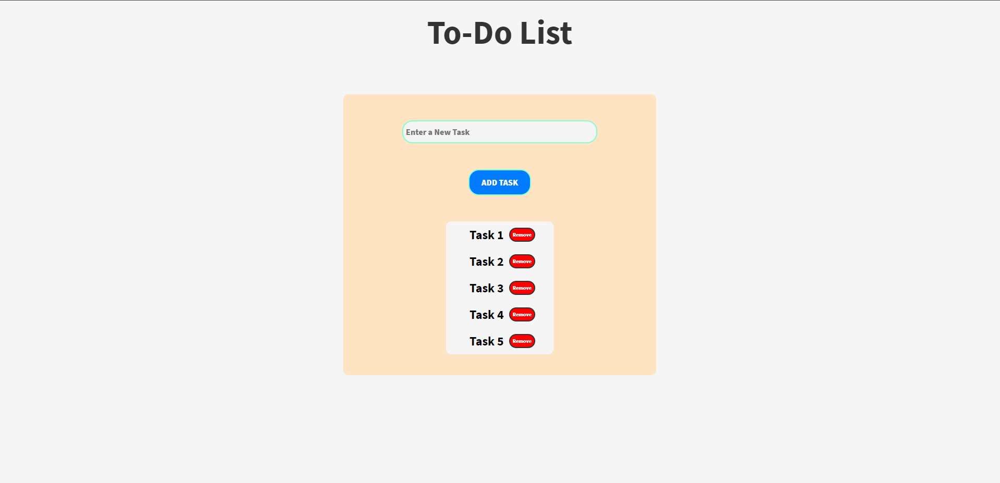

# Basic-To-Do-List-App

In this project, I'll be creating a personal version of a to-do list app project which I already did in the ALX course. Let's go!

I added a css file with basic styling but I wanted to style the various tasks such that the task name is at the far left and the remove nutton is at the far right. I'll get back to it later.

